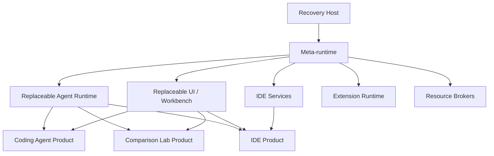
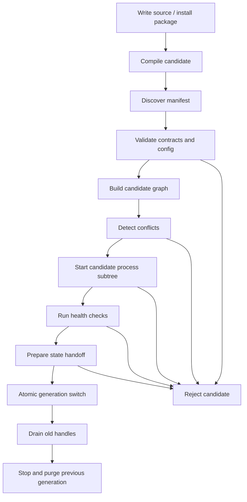
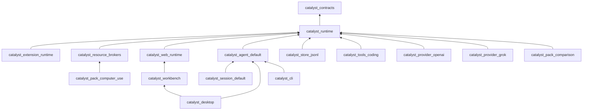

# Catalyst: Architecture Research and Refactoring Plan

> **Status:** architectural research and working migration plan  
> **Repository:** `GoldStrikeArch/catalyst`  
> **Pinned revision:** `75edd980f66764a8b8c40c9d702a90d72938d624`  
> **Analysis date:** August 20, 2026  
> **Scope:** umbrella structure, runtime extensions, session/workflow runtime, provider/tool/UI registries, supervision, packaging, and the declared self-extension model  
> **Limitation:** this is a static architectural audit. The code and test suite were not executed locally while preparing this document.

---

## Table of Contents

1. [Executive Summary](#1-executive-summary)
2. [Catalyst's Original Goal](#2-catalysts-original-goal)
3. [What Is Already Implemented Well](#3-what-is-already-implemented-well)
4. [The Core Architectural Formula](#4-the-core-architectural-formula)
5. [Why the Conventional Three-Layer Model Is Not Enough](#5-why-the-conventional-three-layer-model-is-not-enough)
6. [Target Model: “0 + 3 Layers”](#6-target-model-0--3-layers)
7. [Universal Runtime Graph](#7-universal-runtime-graph)
8. [Three Levels of Extension and Replacement](#8-three-levels-of-extension-and-replacement)
9. [Scope, Precedence, and Binding Lifetime](#9-scope-precedence-and-binding-lifetime)
10. [Generation-Based Activation](#10-generation-based-activation)
11. [State Handoff and Migration](#11-state-handoff-and-migration)
12. [The Agent Runtime as a Replaceable System](#12-the-agent-runtime-as-a-replaceable-system)
13. [Permissions, Trust, and Actual Isolation](#13-permissions-trust-and-actual-isolation)
14. [UI Workbench and the Path Toward an IDE](#14-ui-workbench-and-the-path-toward-an-ide)
15. [Capability Packs and Products](#15-capability-packs-and-products)
16. [Current Architectural Gaps](#16-current-architectural-gaps)
17. [Target Module and Application Boundaries](#17-target-module-and-application-boundaries)
18. [Step-by-Step Refactoring Plan](#18-step-by-step-refactoring-plan)
19. [The First Practical PR](#19-the-first-practical-pr)
20. [Testing Strategy](#20-testing-strategy)
21. [Backward Compatibility and Extension Migration](#21-backward-compatibility-and-extension-migration)
22. [Risks and Anti-Patterns](#22-risks-and-anti-patterns)
23. [Success Metrics](#23-success-metrics)
24. [Proposed ADRs](#24-proposed-adrs)
25. [Final Decisions](#25-final-decisions)
26. [Source-Code References](#26-source-code-references)

---

# 1. Executive Summary

Catalyst should not be treated as an ordinary coding-agent harness with a plugin system. It should be understood as a **self-reconstructing runtime platform** whose default composition happens to be a coding agent.

That distinction is fundamental.

In a conventional plugin architecture, a stable kernel exposes a predefined set of extension points and plugins add features inside those boundaries. Catalyst has a stronger objective:

- the core loop can be replaced;
- the workflow can be replaced;
- prompt and context policy can be replaced;
- providers can be added or replaced;
- permissions can be replaced;
- tools and entirely new classes of tools can be added;
- UI pages, renderers, components, commands, layouts, and assets can be changed;
- shipped BEAM modules can be shadowed;
- extensions can own supervised processes;
- the session runtime, persistence layer, extension runtime, and the complete UI shell can eventually be replaced;
- the same platform can become an IDE, an automation workbench, or another agentic product.

Consequently, the “first layer” must not be a stable agent runtime. The durable engineering asset should instead be the **meta-runtime** that can:

1. describe replaceable services and extension points;
2. construct a runtime graph;
3. resolve overlays by scope and priority;
4. load a candidate generation;
5. verify compatibility and health;
6. atomically activate the new generation;
7. retain old handles until in-flight operations finish;
8. perform state handoff;
9. roll back failed changes;
10. explain its own active composition.

Everything above that meta-runtime should be replaceable: the default agent loop, session engine, provider runtime, tools, permissions, context management, extension manager, workbench UI, IDE services, and product features.

The target architecture is:

```text
minimal Recovery Host
          ↓
universal replacement meta-runtime
          ↓
replaceable agent / UI / IDE systems
          ↓
dynamic product compositions
```

The three-layer development model remains useful, but it needs to become a **“0 + 3 layers”** model:

- **Layer 0 — Recovery Host:** a minimal, rarely changing boot and rollback root.
- **Layer 1 — Meta-runtime:** contracts, runtime graph, generations, scopes, lifecycle, and introspection.
- **Layer 2 — Replaceable Systems / Capability Packs:** all substantive behavior, including what is currently called “core.”
- **Layer 3 — Products:** initial compositions rather than closed distributions.

The first meaningful refactoring step is therefore not a physical split into many umbrella applications and not the extraction of providers. The first step is a **Runtime Service Graph layered over the existing registries**, with `Catalyst.Agent.Loop` and `Catalyst.Workflow.Registry` serving as the initial generation-pinned service-resolution pilot.

---

# 2. Catalyst's Original Goal

`guide.md` establishes several foundational properties of the system:

- the Elixir compiler is included in the release;
- extension source lives outside the immutable application bundle;
- source is compiled and loaded into the already-running BEAM VM;
- an extension is full-trust code inside the process and can call any Elixir, Erlang, or Catalyst function;
- tools, providers, hooks, prompts, workflows, context policies, and UI contributions can be installed at runtime;
- extension contributions are owner-scoped and removed on reload or uninstall;
- an extension may shadow a shipped module, and purge restores the original BEAM;
- CSS and JavaScript may be rebuilt while the application is running;
- safe mode and Git rollback provide recovery mechanisms;
- a custom workflow is already treated as the sovereign owner of a complete agent run.

This means self-extension is not a secondary feature. It is the **primary product principle**.

## 2.1. The Correct Problem Statement

The wrong question is:

> “How do we make the agent core stable while making everything else pluggable?”

The correct question is:

> “How do we keep the entire agentic stack replaceable while making replacement itself controlled, observable, reversible, and compatible with a stateful OTP system?”

## 2.2. Non-Functional Requirements Implied by the Goal

The architecture must support all of the following at the same time:

- **maximum expressive power:** a trusted extension may implement anything;
- **runtime dynamism:** many changes should take effect without a restart;
- **reversibility:** a failed generation must be rollable back;
- **long-lived processes:** extensions may own watchers, sockets, language servers, and terminals;
- **stateful hot replacement:** session, UI, and workspace state cannot always be discarded;
- **multiple temporal boundaries:** a renderer changes on the next render, a loop on the next run, and persistence through a controlled handoff;
- **multi-level overlays:** built-in, product, user, workspace, session, and experiment;
- **self-description:** the agent and the human must be able to determine which implementation is currently active;
- **IDE-scale extensibility:** not only pages and tools, but editors, language services, tasks, debug adapters, keybindings, menus, and virtual file systems;
- **an honest trust model:** an in-process extension is not sandboxed, regardless of permission hooks.

---

# 3. What Is Already Implemented Well

Catalyst already has a strong foundation. Refactoring should preserve these properties rather than sacrifice them for a cleaner directory tree.

## 3.1. Correct Umbrella Dependency Direction

The current structure already separates:

- the headless core;
- the Phoenix/LiveView UI;
- the desktop shell;
- the CLI release.

`catalyst_desktop → catalyst_web → catalyst`, while the core does not directly depend on the web application. Web-only extension kinds are connected indirectly through handlers. This is a sound foundation for host-specific capability sets.

## 3.2. A Serious Extension Lifecycle

The extension runtime already supports:

- runtime compilation;
- owner identity;
- purging prior contributions;
- restoration of shadowed modules;
- generation checks;
- serialized lifecycle transactions;
- safe mode;
- a boot guard;
- Git-backed rollback;
- owner-scoped supervised processes;
- collision tracking;
- replay and reseeding after registry restarts.

This goes far beyond a conventional plugin registry. The target architecture should evolve these mechanisms into a general runtime graph rather than replace them with a simpler abstraction.

## 3.3. Good Public Behaviours

Explicit contracts already exist:

- `Catalyst.Tools.Tool`;
- `Catalyst.LLM.Provider`;
- `Catalyst.Workflow`;
- `Catalyst.Context.Policy`;
- `Catalyst.Extension`.

They define callback shapes, error conventions, streaming semantics, and lifecycle expectations. These contracts can become the first versioned service contracts.

## 3.4. Workflow Is Already a Practical Core-Loop Replacement

`Catalyst.Workflow` already owns a complete run. A custom workflow may call the provider directly, resolve tools, emit events, and decide whether to use the standard hooks and context guard. This is an important signal: `Catalyst.Agent.Loop` is already a default implementation, not an absolute kernel.

## 3.5. Layered Resolution

Prompts, workflows, and context policies already use overlays and fallback layers. When a runtime registration is removed, an application, file, or built-in layer becomes visible again. This is almost a ready-made special case of universal claim resolution.

## 3.6. UI Registries

The UI already supports runtime contributions:

- pages;
- renderers;
- components;
- commands;
- owner purge;
- restoration of built-ins;
- replay after table recovery.

This is a strong base for a future IDE, although the current model is still too page-oriented.

## 3.7. Load-Bearing OTP Invariants Are Explicitly Documented

Supervision ordering and restart semantics are documented in detail and covered by specialized flexibility and chaos tests. Refactoring should preserve these invariants as architectural contracts rather than treat them as incidental details of `Application.start/2`.

---

# 4. The Core Architectural Formula

## 4.1. Catalyst Is Not an Application with Plugins

A more accurate definition is:

> **Catalyst is a self-hosting, self-extensible runtime for building agentic and interactive systems on the BEAM.**

The coding agent is only the default composition.

Under this model:

- chat is one view;
- `Agent.Loop` is one run engine;
- the current `Session.Server` is one session engine;
- the JSONL store is one persistence adapter;
- the Phoenix LiveView shell is one UI runtime;
- OpenAI Codex and Grok are provider packs;
- Computer Use is a capability pack;
- Comparison is a product feature pack;
- an IDE is a workbench composition built on the same runtime.

## 4.2. What Can Actually Be “Immutable”

The claim that “everything can be replaced” needs one precise qualification.

If a component simultaneously:

1. performs an arbitrary replacement of itself; and
2. must guarantee rollback of that same replacement;

then destroying its own rollback mechanism makes recovery impossible. There is always an outer recovery boundary.

In practice:

- all application behavior can be replaced live;
- the meta-runtime can be replaced through a controlled generation switch;
- the final Recovery Host is replaced by an updater or a release restart;
- native binaries and new dependencies may require sidecar installation or an application rebuild.

This matches the limitation already stated in the guide: a new compiled dependency, NIF, or native/wx change requires a rebuild and restart.

---

# 5. Why the Conventional Three-Layer Model Is Not Enough

The original model assumes:

1. a stable technology stack;
2. parameterized modules;
3. a product.

For Catalyst, it would be dangerous to place any of the following in the first layer:

- the core loop;
- session semantics;
- permissions;
- the UI shell;
- workflow implementation;
- persistence;
- the extension-manager implementation.

Doing so would freeze precisely the parts the project wants to make replaceable.

Therefore, “technology stack” must not mean “agent engine” here. It must mean the **machine of composition and replacement**.

```text
Conventional platform:
  stable business/runtime kernel
      + modules
      + product

Catalyst:
  stable replacement meta-protocol
      + replaceable runtime systems
      + dynamic product composition
```

---

# 6. Target Model: “0 + 3 Layers”

## 6.1. Layer 0 — Recovery Host

The Recovery Host is the minimal root whose purpose is to restore the system.

Responsibilities:

- start the active runtime generation;
- retain the last-known-good generation;
- boot into safe mode;
- detect crash loops;
- switch the active profile;
- disable user extensions in an emergency;
- expose a built-in recovery UI or CLI;
- emit basic diagnostics;
- perform a controlled VM or peer-node restart.

It must not know:

- what a tool is;
- what a workflow is;
- which providers exist;
- how a session works;
- what the primary UI looks like;
- what an IDE editor is.

Preferred implementation:

- a small OTP application or launcher-level layer;
- its own minimal generation-pointer store;
- very few dependencies;
- no user callbacks in critical callbacks;
- dedicated smoke and boot-recovery tests.

## 6.2. Layer 1 — Meta-runtime

This is Catalyst's primary long-lived engineering asset.

Responsibilities:

- service and extension-point contracts;
- the runtime graph;
- typed claims;
- scopes and precedence;
- dependency resolution;
- version compatibility;
- generation lifecycle;
- candidate staging;
- health checks;
- the state-handoff protocol;
- process ownership;
- resource brokers;
- provenance;
- introspection;
- effect transport;
- generic host bridges;
- backward-compatibility adapters.

Layer 1 does not implement a concrete agent loop or IDE. It provides the rules through which such systems become replaceable.

## 6.3. Layer 2 — Replaceable Systems / Capability Packs

This layer contains almost all substantive behavior that exists today:

- the default agent loop;
- the default session engine;
- the default reducer and event protocol;
- JSONL persistence;
- tool execution;
- providers;
- authentication flows;
- prompts;
- context compaction;
- permissions;
- child agents;
- self-development;
- model comparison;
- computer use;
- web fetching;
- the default chat workbench;
- IDE services;
- the extension-manager UI;
- the workflow builder.

Layer-2 components may:

- add new services;
- replace existing services;
- define new extension points;
- start process subtrees;
- ship assets;
- ship sidecars;
- provide migrations;
- add UI;
- change product composition.

## 6.4. Layer 3 — Products / Profiles

A product is the initial composition of the runtime graph.

Examples:

```text
Catalyst Coding Agent
Catalyst IDE
Catalyst Comparison Lab
Catalyst Minimal CLI
Catalyst Automation Workbench
Catalyst Restricted Enterprise
```

A product defines:

- the initial pack set;
- default service claims;
- policies;
- branding;
- release composition;
- host availability;
- default settings;
- permitted trust modes.

After startup, the product remains extensible. A product specification is not a closed feature list.

## 6.5. Diagram



---
# 7. Universal Runtime Graph

## 7.1. Why It Is Needed

Today, different subsystems have separate registration mechanisms:

- the tools registry;
- the LLM provider registry;
- the workflow registry;
- the prompt registry;
- the context registry;
- the hooks registry;
- the UI registry;
- extension-process ownership.

That physical separation is useful, but logically all of them solve a similar problem:

> An owner declares an implementation of a logical capability or service that is active in a particular scope and generation; a resolver selects the effective implementation; purge removes the owner and exposes the lower layer.

The Universal Runtime Graph should generalize that model.

This **does not imply one enormous GenServer, one ETS table, or one failure domain**. The semantics and data contracts should be unified. Physical storage and execution may remain specialized.

## 7.2. Core Entities

### Service Key

The logical name of a replaceable service:

```elixir
%Catalyst.Runtime.ServiceKey{
  namespace: "agent",
  name: "run_engine",
  slot: "default"
}
```

A convenient wire representation is:

```text
agent.run_engine/default
```

Examples:

```text
agent.run_engine/default
agent.session_factory/default
agent.transcript_store/default
agent.permission_policy/default
agent.context_guard/default
llm.provider/openai-codex-responses
ui.runtime/default
ui.workbench/default
ide.editor/elixir
ide.debug_adapter/elixir
```

### Contract

A versioned description of what the host expects:

```elixir
%Catalyst.Runtime.ContractRef{
  id: "catalyst.agent-run-engine",
  version: 1
}
```

A contract includes:

- a callback behaviour or protocol;
- input and output schemas;
- error semantics;
- lifecycle rules;
- binding lifetime;
- migration expectations;
- compatibility policy;
- a contract test suite.

### Claim

An owner's declaration that it implements a service key:

```elixir
%Catalyst.Runtime.Claim{
  key: {"agent.run_engine", "default"},
  contract: {"catalyst.agent-run-engine", 1},
  implementation: %{
    module: Catalyst.Gen.G42.ResearchRunEngine,
    config: %{mode: :research}
  },
  owner: "research_runtime",
  generation: 42,
  priority: 300,
  scope: {:workspace, "workspace-1"},
  binding: {:pin, :run},
  trust: :trusted_in_process,
  provenance: {:extension_file, "/.../research_runtime.ex"},
  health: :ready
}
```

### Scope

Where a claim applies:

```text
:global
{:product, product_id}
{:user, user_id}
{:workspace, workspace_id}
{:project, project_id}
{:session, session_id}
{:run, run_id}
{:experiment, experiment_id}
```

Scopes may form a hierarchy. The resolver receives a runtime context and selects the most specific eligible claim.

### Generation

The immutable identity of one activated runtime composition.

A generation should contain:

- the graph digest;
- claims;
- loaded module identities;
- process ownership;
- assets;
- sidecar versions;
- state-schema versions;
- activation timestamp;
- parent generation;
- health status.

### Handle

Resolution returns not merely a module but a pinned handle:

```elixir
%Catalyst.Runtime.Handle{
  key: {"agent.run_engine", "default"},
  contract: {"catalyst.agent-run-engine", 1},
  generation: 42,
  implementation: Catalyst.Gen.G42.ResearchRunEngine,
  owner: "research_runtime",
  lease: lease_ref
}
```

The handle ensures that an in-flight operation does not unexpectedly switch to another generation halfway through its work.

### Extension Point

A description of an accepted class of contributions:

```elixir
%Catalyst.Runtime.ExtensionPoint{
  id: "ide.editor",
  contract: {"catalyst.ide-editor", 1},
  cardinality: :many,
  resolver: Catalyst.IDE.EditorResolver,
  default_binding: {:pin, :document},
  host: :web
}
```

Extension points are themselves registered through the meta-runtime. A new subsystem can therefore bring its own extension ontology without changing a central `ExtensionAPI` module.

### Contribution

A declarative payload for an extension point:

```elixir
%Catalyst.Runtime.Contribution{
  point: "ide.editor",
  id: "elixir",
  value: %{
    module: MyElixirEditor,
    patterns: ["*.ex", "*.exs"]
  },
  owner: "elixir_ide_pack",
  generation: 42,
  scope: :global
}
```

### Provenance

Every effective implementation must explain where it came from:

```text
built-in module
product spec
application config
file
extension owner
workspace profile
session override
experiment
raw module shadow
```

## 7.3. Resolution

Resolution should be pure logic that can be tested independently from ETS or GenServer storage.

A simplified order is:

1. filter claims by service key;
2. reject incompatible contract versions;
3. reject inactive or unhealthy generations;
4. reject claims whose scope does not match the runtime context;
5. reject claims whose predicates do not hold;
6. order by scope specificity;
7. then by explicit priority;
8. then by activation sequence;
9. return a pinned handle;
10. retain an explanation trace.

Example:

```elixir
Catalyst.Runtime.resolve(
  {"agent.run_engine", "default"},
  workspace_id: "w1",
  session_id: "s1",
  run_id: "r1"
)
```

## 7.4. Explain API

This is mandatory in an AI-first architecture:

```elixir
Catalyst.Runtime.explain(
  {"agent.run_engine", "default"},
  workspace_id: "w1",
  session_id: "s1"
)
```

Example result:

```elixir
%{
  selected: %{
    owner: "research_runtime",
    generation: 42,
    scope: {:workspace, "w1"},
    implementation: Catalyst.Gen.G42.ResearchRunEngine
  },
  hidden: [
    %{owner: :product, generation: 7, scope: :global},
    %{owner: :builtin, generation: 1, scope: :global}
  ],
  rejected: [
    %{owner: "old_runtime", reason: :incompatible_contract}
  ],
  binding: {:pin, :run},
  contract: {"catalyst.agent-run-engine", 1}
}
```

The agent should have a read-only tool that can inspect:

- the active graph;
- hidden claims;
- extension points;
- process ownership;
- generation history;
- pending candidate activation;
- migrations;
- resource grants.

## 7.5. Typed Wrappers over the Generic API

Generic API:

```elixir
Catalyst.ExtensionAPI.contribute(api, "ide.editor", payload)
Catalyst.ExtensionAPI.claim(api, service_key, implementation, opts)
Catalyst.ExtensionAPI.define_extension_point(api, spec)
```

Existing convenience functions remain:

```elixir
register_tool(...)
register_provider(...)
register_workflow(...)
register_page(...)
```

But they become wrappers:

```elixir
def register_tool(api, module) do
  contribute(api, "agent.tool", %{module: module})
end
```

This preserves ergonomics while removing the restriction of a fixed set of extension kinds.

---

# 8. Three Levels of Extension and Replacement

Maximum flexibility does not require one mechanism for every use case.

## 8.1. Level A — Managed Contributions

This is the preferred path.

Properties:

- a declarative manifest;
- versioned contracts;
- schema-validated configuration;
- a dependency graph;
- conflict detection;
- transactional activation;
- health checks;
- automatic rollback;
- introspection;
- generation ownership;
- state-migration declarations.

Suitable for:

- tools;
- providers;
- workflows;
- prompt and context policies;
- UI views;
- commands;
- IDE language packs;
- tasks;
- formatters;
- model catalogs.

## 8.2. Level B — Sovereign Subsystem Replacement

An extension replaces an entire subsystem root and defines its own internal process architecture.

Examples:

- a different session engine;
- a distributed agent runtime;
- a different UI workbench;
- a CRDT workspace;
- a remote execution runtime;
- an alternative extension manager;
- an event-sourced persistence runtime.

The host interacts with it only through a narrow contract:

```elixir
@callback child_spec(config()) :: Supervisor.child_spec()
@callback open(context()) :: {:ok, handle()} | {:error, term()}
@callback command(handle(), command()) :: result()
@callback snapshot(handle()) :: {:ok, term()} | {:error, term()}
@callback prepare_handoff(handle(), target_version()) :: {:ok, capsule()} | {:error, term()}
```

A sovereign subsystem may internally use any processes and registries it wants, but it must satisfy the host contract.

## 8.3. Level C — Raw BEAM Override

The existing ability to shadow an arbitrary module should remain.

It is required as:

- an absolute escape hatch;
- a way to repair a live system experimentally;
- a path for changing areas that have not yet been formalized;
- a self-development instrument.

However, a raw override should be explicitly classified as opaque:

```text
activation mode: immediate
transactional guarantees: limited
state handoff: unknown
dependency graph: partially observable
compatibility: caller-owned
rollback: BEAM restoration / extension rollback
```

## 8.4. Why Raw Override Must Not Become the Primary API

If extensibility is built only on module shadowing:

- affected services cannot be known in advance;
- compatibility is difficult to verify;
- multiple interdependent replacements cannot be activated atomically;
- an in-flight run may combine old metadata with new code;
- a stateful process may retain an old struct shape;
- hidden direct calls bypass graph resolution;
- an IDE-scale plugin ecosystem becomes unmanageable.

The principle should therefore be:

> Managed first, sovereign when necessary, raw always available.

---

# 9. Scope, Precedence, and Binding Lifetime

## 9.1. Scope Overlays

A single service key may have several implementations:

```text
built-in
  ↓
product default
  ↓
user profile
  ↓
workspace override
  ↓
session override
  ↓
run experiment
```

Removing an upper claim does not restore a captured value. It simply exposes the current lower layer. That distinction matters for live configuration and parallel scopes.

## 9.2. Not Every Override Should Be Global

Examples:

- one workspace uses an IDE workbench while another uses the chat shell;
- one session uses a research workflow;
- a comparison lane pins a separate provider and model;
- one project uses a restrictive permission policy;
- an experimental renderer is active only in a preview session.

A global singleton registry is therefore insufficient as the semantic model.

## 9.3. Binding Lifetime

“Everything can be replaced” does not mean that every active operation should immediately jump to new code.

Recommended defaults:

| Service | Binding lifetime |
|---|---|
| UI renderer | `:render` |
| UI command | `:invocation` |
| permission policy | `:action` |
| tool set | `:turn` |
| tool-executor metadata | `:tool_batch` |
| provider | `:request` or `:run` |
| run engine/workflow | `:run` |
| context policy | `:request` or `:run` |
| session semantics | `:session` |
| persistence backend | `:session` until handoff |
| workbench root | `:mount` until remount or handoff |
| extension runtime | `:generation` |
| native helper | `:worker_instance` |

A claim may explicitly change the default:

```elixir
binding: :live
binding: {:pin, :turn}
binding: {:pin, :run}
binding: {:pin, :session}
```

## 9.4. Handles and Leases

Resolving a service increments the lease count for its generation. The old generation is not purged while:

- pinned handles still exist;
- sessions or runs belonging to it remain active;
- handoff has not completed;
- the drain timeout has not expired.

This allows:

```text
Run A -> generation 41 -> finishes normally
Run B -> generation 42 -> uses the new loop
```

without mixing implementations.

---

# 10. Generation-Based Activation

## 10.1. The Problem with Imperative Setup

The current `setup/1` may perform side effects while registering contributions. If setup registers several contributions and then fails, some of those changes may remain active. That can be acceptable for a tool or a page; it is not acceptable when replacing a session engine or an entire UI runtime.

## 10.2. Target Lifecycle



Before the atomic switch, the active graph does not change.

## 10.3. Candidate Graph

A candidate generation contains the complete proposed delta:

```elixir
%Catalyst.Runtime.Candidate{
  id: 42,
  parent: 41,
  claims: [...],
  extension_points: [...],
  processes: [...],
  assets: [...],
  sidecars: [...],
  migrations: [...],
  permissions: [...],
  digest: "..."
}
```

## 10.4. Module Staging

The BEAM supports current and old code, but a full blue/green lifecycle with identical module names is constrained. Managed extensions should therefore prefer generation-scoped physical names:

```text
Logical module:  MyIDE.Editor
Physical module: Catalyst.Gen.G42.MyIDE.Editor
```

The service graph keeps logical identity separate from loaded-module identity.

Raw shadowing continues to use original names and immediate activation.

## 10.5. A Separate Node for Complex Candidates

Large, risky, or isolated extensions may run on a peer Erlang node:

```text
Recovery/Host node
       ↕ versioned protocol
Candidate runtime node
```

Advantages:

- true blue/green staging;
- separate process heaps and ETS ownership;
- the candidate can be terminated completely;
- NIF crashes can be isolated by moving the NIF to a separate node or OS process;
- replacing the entire extension runtime becomes easier.

This is not required for the first implementation, but meta-runtime contracts must not assume that every implementation is a local module call.

## 10.6. Rollback

Rollback levels:

1. **Pre-activation rejection:** the active generation never changed.
2. **Immediate post-activation rollback:** the pointer returns to the parent generation.
3. **Stateful rollback:** a reverse migration or preserved source capsule is used.
4. **Crash-loop rollback:** the Recovery Host activates the last-known-good generation.
5. **Raw-override rollback:** saved BEAM binaries and prior claims are restored.

---
# 11. State Handoff and Migration

## 11.1. Why Module Hot-Swap Is Not Enough

Stateful OTP processes continue to hold:

- old structs;
- old queue semantics;
- process-dictionary entries;
- ETS ownership;
- monitors;
- ports;
- open files;
- provider continuations;
- session handles.

Replacing a module does not automatically transform old state into new state.

## 11.2. Handoff Contract

For a stateful service:

```elixir
@callback state_version() :: non_neg_integer()

@callback prepare_handoff(handle(), target_contract()) ::
  {:ok, capsule()} | {:error, term()}

@callback accept_handoff(capsule(), source_contract()) ::
  {:ok, new_handle()} | {:error, term()}

@callback verify_handoff(old_handle(), new_handle()) ::
  :ok | {:error, term()}

@callback rollback_handoff(new_handle(), old_capsule()) ::
  :ok | {:error, term()}
```

A capsule should be:

- versioned;
- bounded;
- serializable, or explicitly process-local;
- protected by a checksum;
- free of raw PIDs when migration crosses a node or restart boundary;
- accompanied by provenance.

## 11.3. Handoff Strategies

### Strategy A: New Instances Only

The new implementation is used only for newly created sessions or documents.

This is appropriate for the first migration stage.

### Strategy B: Quiesce and Move

- reject new commands;
- wait for the current operation to finish;
- snapshot state;
- create a new process;
- verify it;
- switch the handle;
- terminate the old process.

### Strategy C: Dual-Run Verification

The old and new reducers receive the same events and their results are compared before switching.

This is appropriate for critical session-state transitions.

### Strategy D: Replay from a Durable Log

The new runtime reconstructs state from an event log or JSONL transcript.

This is a natural fit for Catalyst because sessions are already durable.

### Strategy E: Proxy PID

A stable host process remains in place while its semantic engine and state capsule are replaced internally.

## 11.4. Versioned Event Protocol

If the reducer and session engine are replaceable, events need:

- an envelope version;
- a stable event ID;
- a causation ID;
- a correlation or run ID;
- a producer contract;
- a payload-schema version;
- an optional compatibility adapter.

Elixir struct identity alone is not sufficient when events must survive an implementation or release change.

---

# 12. The Agent Runtime as a Replaceable System

## 12.1. Current Semantic Decomposition

Today, a complete agent run is distributed across:

- `Session.Server` — state owner and mailbox boundary;
- `Session.RunConfig` — host-side preflight;
- `Session.RunContext` — worker-side assembly;
- `Workflow.Registry` — selection;
- `Catalyst.Workflow` — the full-run contract;
- `Agent.Loop` — the default run implementation;
- `Workflow.Support` — provider, tool, context, and hook helpers;
- `Session.Reducer` — state folding;
- `Session.Store` — durability;
- `EventSink` — observer and debug semantics;
- `Tools.Registry` and `ToolRunner`;
- the provider registry and provider implementations;
- the context guard;
- hooks.

This is already a reasonably modular decomposition, but the logical service boundaries have not been formalized.

## 12.2. Proposed Logical Services

```text
agent.session_factory/default
agent.session_engine/default
agent.run_engine/default
agent.event_protocol/default
agent.reducer/default
agent.tool_resolver/default
agent.tool_executor/default
agent.context_guard/default
agent.permission_policy/default
agent.transcript_store/default
agent.observer_pipeline/default
agent.child_session_policy/default
agent.model_resolver/default
```

Not all of these need to become separate process boundaries immediately. Resolution contracts are enough to begin with.

## 12.3. `Agent.Loop` as the First Pilot

Current mapping:

```text
Service key:    agent.run_engine/default
Contract:       catalyst.agent-run-engine/1
Built-in claim: Catalyst.Agent.Loop
Binding:        run
Resolver:       Workflow.Registry adapter
```

Named workflows may become:

```text
agent.run_engine/research
agent.run_engine/security-review
agent.run_engine/template:<id>
```

The session `workflow` option selects the slot or name. The session `loop` option remains a legacy direct implementation override.

## 12.4. Managed Session Engine

One option preserves a stable process host:

```elixir
defmodule Catalyst.Contracts.SessionEngine.V1 do
  @callback init(config()) :: {:ok, state(), [effect()]}

  @callback command(state(), command(), context()) ::
    {:ok, state(), [effect()]} | {:error, term()}

  @callback event(state(), event(), context()) ::
    {:ok, state(), [effect()]} | {:error, term()}

  @callback snapshot(state()) :: {:ok, term()} | {:error, term()}

  @callback restore(term(), source_version()) ::
    {:ok, state()} | {:error, term()}
end
```

The host process interprets effects:

```text
{:persist, event}
{:broadcast, topic, message}
{:start_task, spec}
{:stop_task, id}
{:schedule, timeout, message}
{:emit, event}
{:register_resource, resource}
{:release_resource, resource}
```

Benefits:

- the extension does not perform host side effects directly inside reducer callbacks;
- the pure state machine is easier to test;
- two engines can be dual-run and compared;
- a stable PID simplifies LiveView reconnects;
- the effect interpreter can be instrumented and constrained.

## 12.5. Sovereign Session Factory

For complete freedom:

```elixir
defmodule Catalyst.Contracts.SessionFactory.V1 do
  @callback child_spec(session_config()) :: Supervisor.child_spec()
  @callback locate(session_id()) :: {:ok, handle()} | :error
  @callback command(handle(), command()) :: term()
  @callback snapshot(handle()) :: {:ok, term()} | {:error, term()}
  @callback terminate(handle(), reason()) :: :ok
end
```

This enables:

- remote or distributed sessions;
- shared multi-user sessions;
- CRDT sessions;
- an actor graph instead of a single GenServer;
- database-backed session runtimes;
- IDE task sessions;
- sandboxed worker sessions.

## 12.6. Persistence as a Separate Service

The current JSONL store is a strong default, but it should not be the only possible backend.

Contract:

```elixir
@callback open(session_identity(), opts()) :: {:ok, handle()} | {:error, term()}
@callback append(handle(), envelope()) :: :ok | {:error, term()}
@callback fold(handle(), reducer()) :: {:ok, term()} | {:error, term()}
@callback checkpoint(handle(), state_capsule()) :: :ok | {:error, term()}
@callback close(handle()) :: :ok
```

Possible implementations:

- local JSONL;
- SQLite;
- PostgreSQL or another event store;
- an encrypted local store;
- an ephemeral in-memory store;
- a remote collaboration store.

## 12.7. Provider and Model Catalog

A provider pack should supply more than `stream/4`; it should supply a descriptor:

```elixir
%ProviderDescriptor{
  id: :grok,
  api: "grok-subscription-chat-completions",
  provider_contract: {"catalyst.llm-provider", 1},
  provider: Grok.Provider,
  catalog: Grok.ModelCatalog,
  auth_flow: Grok.AuthFlow,
  controls: Grok.Controls,
  capabilities: [:network, :credentials]
}
```

This removes direct OpenAI and Grok imports from generic UI and Comparison code.

---

# 13. Permissions, Trust, and Actual Isolation

## 13.1. Permission Policy as a Replaceable Service

Proposed contract:

```elixir
@callback authorize(action(), principal(), resource(), context()) ::
  :allow
  | {:deny, reason()}
  | {:challenge, challenge_spec()}
  | {:delegate, policy_key()}
```

Policy stack:

```text
host hard constraints
product policy
workspace policy
session policy
temporary human approval
```

Example implementations:

- auto-allow;
- deny-list;
- working-directory allow-list;
- per-action approval;
- enterprise policy;
- audit-only mode;
- policy from a remote control plane.

## 13.2. A Permission Hook Is Not a Sandbox

A trusted in-process extension can:

- call `File` directly;
- execute `System.cmd`;
- access ETS;
- stop a process;
- modify the code server;
- invoke internal Catalyst APIs;
- remove its own permission hook.

A permission policy therefore controls **brokered actions**, but it does not constrain arbitrary in-process code.

This distinction must be explicit in manifests and UI.

## 13.3. Trust Classes

```text
:compiled_trusted
:local_trusted
:isolated_worker
:remote_service
```

### `:compiled_trusted`

The pack is included in the release and passes the full testing and review pipeline.

### `:local_trusted`

A source extension is compiled into the main VM and has full access. This is Catalyst's current primary model.

### `:isolated_worker`

The extension runs in an external OS process or peer node and accesses resources through a protocol.

### `:remote_service`

The implementation lives outside the local process or machine.

## 13.4. Resource Brokers

Enforceable policies require brokers such as:

```text
Filesystem Broker
Network Broker
Process Broker
Credential Broker
Desktop/Computer Broker
Secret Broker
Workspace Broker
Notification Broker
```

Request:

```elixir
Catalyst.Resources.request(
  handle,
  {:filesystem, :write, path},
  payload
)
```

The broker:

1. resolves the effective permission policy;
2. checks trust and capabilities;
3. performs the action;
4. records provenance;
5. returns a bounded result.

A trusted extension can still bypass the broker. An isolated extension cannot.

## 13.5. Human-Only Channels

The guide correctly notes that approval state must not be stored in a file the agent can create itself. The meta-runtime should model human-controlled input channels explicitly:

```text
UI gesture
OS secure prompt
external approval service
hardware-backed confirmation
operator-owned console
```

A policy challenge should identify an admissible channel instead of merely returning a textual instruction.

---

# 14. UI Workbench and the Path Toward an IDE

## 14.1. Limitation of the Current Page-Oriented Model

Runtime pages, renderers, components, and commands make the UI substantially extensible, but an IDE requires a richer model:

- document lifecycle;
- editor groups;
- panes and docks;
- file tree;
- terminals;
- task output;
- language servers;
- diagnostics;
- source control;
- keybindings;
- menus;
- context keys;
- themes;
- state restoration.

This cannot be solved by indefinitely adding special callbacks to `ShellLive`.

## 14.2. `Catalyst.Workbench`

Proposed replaceable subsystem:

```text
ui.runtime/default
ui.workbench/default
ui.layout/default
```

Extension points:

```text
workbench.view
workbench.editor
workbench.panel
workbench.activity
workbench.status_item
workbench.layout
workbench.welcome

ui.command
ui.keybinding
ui.menu
ui.context_key
ui.setting_schema
ui.theme

workspace.document_provider
workspace.file_system_provider
workspace.project_adapter
workspace.search_provider

ide.language
ide.language_server
ide.formatter
ide.task_provider
ide.debug_adapter
ide.terminal_profile
ide.source_control
```

## 14.3. Chat as a Workbench View

The current chat should become a contribution:

```elixir
%Workbench.View{
  id: "agent.chat",
  module: Catalyst.Chat.View,
  location: :main,
  retain_state: true
}
```

Model Comparison becomes another view or view group. The workflow builder becomes another. The Extensions page becomes a management view.

## 14.4. Root Trampoline

Replacing the entire UI root requires a small host LiveView:

```elixir
defmodule CatalystWeb.HostLive do
  use CatalystWeb, :live_view

  def mount(params, session, socket) do
    with {:ok, handle} <- Catalyst.Runtime.resolve({"ui.runtime", "default"}, ui_context(socket)),
         {:ok, socket} <- handle.impl.mount(params, session, socket) do
      {:ok, assign(socket, :ui_runtime_handle, handle)}
    end
  end

  def handle_event(name, params, socket) do
    socket.assigns.ui_runtime_handle.impl.handle_event(name, params, socket)
  end

  def handle_info(message, socket) do
    socket.assigns.ui_runtime_handle.impl.handle_info(message, socket)
  end

  def render(assigns) do
    assigns.ui_runtime_handle.impl.render(assigns)
  end
end
```

A real implementation will need safe dispatch, reconnect, and remount semantics, but the principle allows the entire shell to be replaced.

## 14.5. UI Handoff

When replacing the workbench:

1. the old runtime produces a layout capsule;
2. active documents and view states are serialized;
3. the new runtime accepts the capsule;
4. a remount or reload occurs;
5. if acceptance fails, the old runtime remains active.

The capsule must not contain arbitrary socket internals. It needs a versioned workbench-state format.

## 14.6. Runtime HTTP Routes

A compile-time Phoenix router cannot be changed completely without recompilation. Runtime extensions therefore need a precompiled dispatcher:

```text
/ext/:owner/*path
/api/ext/:owner/*path
/ws/ext/:owner/*path
```

Compiled trusted packs may additionally participate in compile-time route composition.

## 14.7. Assets

Writing into the bundle creates problems for an application installed in `/Applications`. The target model is:

```text
~/.catalyst/runtime-assets/<owner>/<generation>/<digest>/
```

Endpoint resolution:

```text
active-generation assets
  ↓
user-overlay assets
  ↓
packaged assets
```

Asset builds should be transactional:

- build into a temporary directory;
- compute a digest;
- run a health check;
- atomically switch the pointer;
- keep old assets while old handles are active;
- garbage-collect after drain.

## 14.8. Native and Language Tooling

An IDE will require binaries that cannot be introduced dynamically as Elixir dependencies:

- language servers;
- debug adapters;
- formatters;
- parsers;
- indexers;
- terminal helpers.

They should preferably be shipped as supervised sidecars:

```text
~/.catalyst/workers/<pack>/<version>/bin/...
```

A pack manifest describes:

- platform and architecture;
- digest and signature;
- protocol version;
- installation and update lifecycle;
- permissions;
- health checks.

---

# 15. Capability Packs and Products

## 15.1. Revised Definition of a Pack

> A pack is an installable fragment of the runtime graph that may add or replace services, define new extension points, start process trees, ship UI/assets/sidecars, and migrate state.

## 15.2. Manifest

```elixir
%Catalyst.Pack.Manifest{
  id: "catalyst.ide.elixir",
  version: "1.0.0",
  catalyst_api: ">= 1.0.0 and < 2.0.0",
  trust: :compiled_trusted,
  hosts: [:web, :desktop],
  platforms: [:darwin, :linux],
  requires: [
    {"ui.workbench", ">= 1"},
    {"resource.process", ">= 1"}
  ],
  capabilities: [:filesystem, :process],
  config_schema: %{...},
  services: [...],
  extension_points: [...],
  contributions: [...],
  processes: [...],
  assets: [...],
  sidecars: [...],
  migrations: [...],
  health_checks: [...]
}
```

## 15.3. Compiled Packs and Runtime Extensions

### Compiled Pack

A compiled pack may:

- add Mix dependencies;
- include native code;
- participate in the release;
- add compile-time routes;
- ship migrations;
- own its own OTP application.

### Runtime Extension

A runtime extension may:

- use dependencies already present in the release;
- load Elixir modules;
- register or replace services;
- define extension points;
- start processes;
- ship runtime assets;
- download and run sidecars when policy allows it.

Without a rebuild, it cannot:

- add a newly linked Mix dependency to the current release;
- safely embed a new NIF in the main VM;
- change the compiled Phoenix router outside the generic dispatcher;
- replace ERTS, wx, or the native application bundle.

## 15.4. Product Spec

```elixir
%Catalyst.Product.Spec{
  id: "catalyst-ide",
  packs: [
    "catalyst.meta-runtime",
    "catalyst.agent.default",
    "catalyst.workbench.default",
    "catalyst.ide.core",
    "catalyst.ide.elixir",
    "catalyst.provider.openai",
    "catalyst.tools.coding"
  ],
  default_claims: [...],
  policies: [...],
  branding: %{...},
  release: %{...}
}
```

The product specification creates generation 1. Subsequent extensions create generations 2, 3, and so on.

## 15.5. Example Packs

### OpenAI Codex Pack

- provider;
- OAuth flow;
- model catalog;
- controls descriptor;
- connection and cache processes;
- UI settings contribution;
- authentication-status contribution.

### Grok Pack

The same pattern, without changes to generic core or generic UI.

### Computer Use Pack

- tools;
- permission and capability declarations;
- native-helper sidecar;
- process subtree;
- UI diagnostics view;
- packaging contribution;
- platform constraints.

### Comparison Pack

- comparison service;
- persistence;
- Git workspace adapter;
- UI views and routes;
- model-resolver dependency;
- commands;
- product navigation.

### IDE Pack

- workbench replacement;
- editor extension point;
- document model;
- task, debug, and language extension points;
- initial explorer, editor, and terminal views.

---
# 16. Current Architectural Gaps

## 16.1. Registries Know Specific Built-ins

`Tools.Registry` contains a hard-coded tool list, and `LLM.Registry` contains a hard-coded map of built-in providers. This mixes mechanism with product composition.

Target rule:

```text
Registry owns mechanism
Pack owns capability
Product owns initial selection
```

## 16.2. `ExtensionAPI` Enumerates a Fixed Ontology

Manual functions such as `register_tool`, `register_provider`, `register_workflow`, and `register_page` are useful typed APIs, but a central list of kinds constrains future IDE extensions.

Generic `contribute`, `claim`, and `define_extension_point` operations are needed.

## 16.3. Imperative `setup/1` Allows Partial Side Effects

This behavior may remain for legacy extensions, but a managed generation must first construct a declarative graph delta and only then activate it.

## 16.4. Raw Module Shadowing Has No Binding Lifetime

A globally hot-swapped module may alter the behavior of an already-running run. That is acceptable for the ultimate escape hatch, but managed services should use generation-scoped modules and pinned handles.

## 16.5. `apps/catalyst` Mixes Meta-runtime and Capabilities

A single application currently contains:

- sessions;
- the extension runtime;
- providers;
- provider authentication;
- model comparison;
- computer use;
- fetch;
- shell sessions;
- child agents;
- coding tools.

Physical separation should happen after semantic inversion. Otherwise, cycles and artificial facades are likely.

## 16.6. Generic Web Code Depends on Specific Providers

`ShellLive.Settings` knows about OpenAI and Grok authentication, catalogs, and controls. Adding a provider family requires changing generic UI.

Provider, model, authentication, and controls descriptors should replace those imports.

## 16.7. Comparison Depends on an OpenAI Model Constructor

Generic comparison code should call a model-catalog or model-resolver service rather than `OpenAICodex.model/1`.

## 16.8. The UI Shell Is a Product Controller

`ShellLive` controls chat, models, authentication, workflows, computer state, extensions, sessions, and chrome. An IDE needs a replaceable workbench root and feature-owned controllers.

## 16.9. Desktop Concerns Leak into the Web Application

`Desktop.Endpoint`, webview ETS sessions, and `Desktop.Auth` live in the web host. In the target architecture, browser and desktop hosts should be distinct product adapters over a shared web/workbench runtime.

## 16.10. Build and Release Logic Is Centralized in Root `mix.exs`

Packaging currently owns assets, fast tools, the Objective-C helper, signing, plist mutation, the launcher, and DMG/PKG rebuilding. Packs should declare release contributions, while the product/build layer assembles them.

## 16.11. The Permission Model Does Not Separate Semantic Policy from Isolation

The UI must state clearly that a `local_trusted` extension has full VM access even when individual tools are hidden by a permission policy.

## 16.12. There Is No Unified Self-Description Graph

Individual registries provide introspection, but there is no single answer to: “Why is this implementation active, and what will be removed if this owner is uninstalled?”

---

# 17. Target Module and Application Boundaries

The physical split is a north star, not the first migration step.

```text
apps/
  catalyst_recovery
  catalyst_contracts
  catalyst_runtime
  catalyst_extension_runtime
  catalyst_resource_brokers
  catalyst_web_runtime
  catalyst_workbench

  catalyst_agent_default
  catalyst_session_default
  catalyst_store_jsonl
  catalyst_tools_coding
  catalyst_tools_self_development
  catalyst_provider_openai
  catalyst_provider_grok
  catalyst_pack_comparison
  catalyst_pack_computer_use
  catalyst_ide_core
  catalyst_ide_elixir

  catalyst_desktop
  catalyst_cli

tools/
  catalyst_build
```

## 17.1. Dependencies



## 17.2. Forbidden Dependencies

```text
catalyst_runtime -> a concrete provider
catalyst_runtime -> a concrete tool pack
catalyst_runtime -> Comparison
catalyst_runtime -> Computer Use
catalyst_runtime -> Phoenix UI
catalyst_web_runtime -> OpenAI/Grok modules
pack -> a concrete product
contracts -> runtime implementation
```

## 17.3. Current to Target Mapping

| Current area | Target role |
|---|---|
| `Message`, `Content`, `Model`, event envelopes | Contracts |
| `Tools.Tool`, `LLM.Provider`, `Workflow`, `Context.Policy` | Versioned Contracts |
| `Workflow.Registry` mechanism | Runtime adapter |
| `Agent.Loop` | Default Agent Pack |
| `Session.Server`, `Reducer`, `RunContext` | Default Session Pack |
| `Session.Store` | JSONL Store Pack |
| `Extensions.*` | Extension Runtime |
| `ExtensionAPI` | Compatibility facade over the Runtime Graph |
| `Tools.Registry` mechanism | Runtime registry adapter |
| default tool list | Product or pack contributions |
| `LLM.Registry` mechanism | Runtime registry adapter |
| provider built-ins | Provider packs or product claims |
| `OpenAIOAuth`, `XAIOAuth` | Provider packs |
| `Prompt/Context/Workflow` overlays | Runtime graph scopes and adapters |
| `UI.Registry` | Web runtime adapter |
| built-in UI pages | Workbench or product packs |
| `ShellLive` | Default Chat Workbench, later a thin host |
| `Comparison.*` | Comparison Pack |
| `Computer.*` | Computer Use Pack |
| release helpers | Build layer and pack release contributions |

---
# 18. Step-by-Step Refactoring Plan

The plan deliberately avoids a big-bang rewrite. Every stage should leave the application working and preserve the current extension model.

## Stage 0. Freeze Invariants and Establish a Baseline

### Goal

Turn current behavior into an explicit specification before changing semantic boundaries.

### Changes

- add an ADR for the “everything is replaceable” philosophy;
- document current extension guarantees;
- document current binding semantics for workflows, tools, UI, and providers;
- snapshot the effective built-ins;
- add a machine-readable registry inventory;
- add a dependency-graph report through `mix xref`;
- record the current supervision tree and restart invariants;
- classify API surfaces as `public`, `extension-public`, or `internal`.

### Tests

- snapshot the built-in tool list;
- snapshot providers, workflows, pages, and commands;
- extension reload, purge, and recovery tests;
- release smoke tests;
- flexibility and chaos suites;
- session resume;
- UI reconnect.

### Exit Criteria

- every later PR can prove that it did not accidentally change the effective composition;
- a compatibility baseline is documented;
- forbidden dependency edges are known.

---

## Stage 1. Introduce the Runtime Graph as a Pure Model

### Goal

Create shared data structures and a resolver without changing existing registries.

### New Modules

```text
Catalyst.Runtime.ServiceKey
Catalyst.Runtime.ContractRef
Catalyst.Runtime.Scope
Catalyst.Runtime.Claim
Catalyst.Runtime.Generation
Catalyst.Runtime.Handle
Catalyst.Runtime.Context
Catalyst.Runtime.Resolution
Catalyst.Runtime.Resolver
Catalyst.Runtime.Explanation
```

### Changes

- a pure resolver with no processes or ETS;
- deterministic precedence rules;
- explicit rejection reasons;
- a scope hierarchy;
- priority and activation sequence;
- a contract-compatibility callback;
- graph digesting;
- an explanation trace.

### Do Not Do Yet

- do not move existing registries;
- do not change `ExtensionAPI`;
- do not change lifecycle behavior;
- do not change production paths.

### Tests

- table-driven resolver tests;
- property tests for deterministic resolution;
- property: removing the selected claim exposes the next eligible claim;
- property: a more specific scope wins;
- property: unhealthy or incompatible claims are never selected;
- digest stability.

### Exit Criteria

- the resolver is pure, complete, and suitable for all current registry kinds;
- every precedence decision is explainable.

---

## Stage 2. Runtime Graph as a Read Model over Existing Registries

### Goal

Provide a unified introspection surface without changing the write path.

### Changes

- adapters export current registry entries as claims;
- built-ins receive explicit owner and provenance metadata;
- `Runtime.snapshot/0` aggregates tools, providers, workflows, prompts, context, and UI;
- `Runtime.explain/2` works for current kinds;
- add a read-only `runtime_graph` tool;
- add a UI graph inspector to the Extensions or Diagnostics view.

### Tests

- graph snapshots match registry data;
- owner purge is reflected in the graph;
- registry restart and replay do not alter the logical explanation;
- a missing ETS table produces a degraded snapshot rather than falsely reporting an empty system.

### Exit Criteria

- both human and agent can obtain one coherent answer about the current composition;
- no production resolver depends on the graph yet.

---

## Stage 3. Pilot: `agent.run_engine`

### Goal

Move the core loop first to a service claim and a generation-pinned handle.

### Changes

- define contract `catalyst.agent-run-engine/1`;
- register `Catalyst.Agent.Loop` as a built-in claim;
- adapt runtime workflows to claims and slots;
- turn `Workflow.Registry.resolve/1` into a compatibility facade;
- pass a `Runtime.Handle` into `RunContext`, not only a module;
- pin the handle for the duration of a run;
- include owner, generation, and contract in run metadata;
- uninstalling a workspace override exposes the default claim;
- keep direct `opts[:loop]` as the legacy highest-priority session claim.

### Semantics

- a new generation applies only to a new run;
- an active run continues using the old implementation;
- raw shadowing retains immediate BEAM semantics and is marked opaque.

### Tests

- global replacement;
- workspace replacement;
- session replacement;
- named run engines;
- old-run and new-run concurrency;
- owner purge;
- generation-lease drain;
- session resume does not persist a physical generation module;
- invalid contracts are rejected before a run starts.

### Exit Criteria

- `Agent.Loop` is no longer a hard-coded fallback outside the initial built-in claim;
- run diagnostics explain the selected engine;
- the existing public Workflow API remains compatible.

---

## Stage 4. Generic Extension Points

### Goal

Allow subsystem extensions to define new classes of contributions.

### New APIs

```elixir
ExtensionAPI.define_extension_point(api, spec)
ExtensionAPI.contribute(api, point_id, payload, opts)
ExtensionAPI.claim(api, service_key, implementation, opts)
```

### Changes

- add `ExtensionPoint.Registry`;
- validate schemas and contracts;
- make extension-point lifecycle owner-aware;
- do not activate a contribution unless its host extension point exists;
- reimplement current typed APIs as wrappers over the generic API;
- return a structured error for an unsupported point;
- allow an extension point to provide a custom resolver adapter.

### Special Case

When an extension defines an extension point and contributes to that same point, the loader must:

1. register the candidate point in the staging graph;
2. validate candidate contributions against it;
3. activate the complete set in one generation switch.

### Tests

- one extension defines a new point;
- another extension contributes to it;
- purging the host point either deactivates dependents correctly or is blocked by dependency policy;
- schema mismatch;
- contract-version mismatch;
- collision and cardinality rules;
- current `register_*` behavior remains unchanged.

### Exit Criteria

- adding `ide.editor` does not require changing the central `ExtensionAPI` module;
- current kinds are ordinary extension-point adapters.

---

## Stage 5. Declarative Manifest and Candidate Generations

### Goal

Separate compilation and discovery from activation, and eliminate partial managed activation.

### Manifest API

```elixir
def manifest do
  %Catalyst.Extension.Manifest{
    api: 2,
    id: "...",
    contracts: [...],
    services: [...],
    extension_points: [...],
    contributions: [...],
    processes: [...],
    migrations: [...],
    health_checks: [...]
  }
end
```

### Changes

- introduce `Catalyst.Extension` v2;
- compile candidate modules;
- ensure manifest discovery performs no arbitrary activation side effects;
- build a candidate graph;
- validate dependencies, collisions, and configuration;
- stage the owner process supervisor;
- run bounded health checks;
- atomically switch the active-generation pointer;
- drain the old generation;
- clean up the candidate on error.

### Legacy Adapter

Extensions that use `setup/1`:

- continue to work;
- are marked `api: 1`, `activation: :imperative`;
- keep the current lifecycle;
- expose reduced guarantees in introspection;
- may migrate gradually to manifest v2.

### Tests

- setup or manifest failure before activation changes nothing;
- atomic activation across multiple services;
- health-check rejection;
- candidate-process crash;
- activation race;
- stale candidate generation;
- crash immediately after the pointer switch;
- rollback to parent;
- boot recovery.

### Exit Criteria

- a managed v2 extension activates completely or not at all;
- current v1 extensions do not break.

---

## Stage 6. Generation-Scoped Modules and Leases

### Goal

Prevent managed operations from mixing BEAM generations.

### Changes

- add generation-scoped physical module namespaces;
- keep logical module identity in the manifest;
- map logical modules to physical modules in the code loader;
- add generation lease reference counts;
- delay purge;
- define drain timeout and forced-cleanup policy;
- retain old assets and sidecars until drain completes;
- keep raw shadowing as a separate path.

### Tests

- two generations of one logical service operate concurrently;
- an old run uses the old physical module;
- a new run uses the new one;
- purge occurs only after the last handle is released;
- leak detection;
- forced drain timeout;
- physical module-name collision.

### Exit Criteria

- a managed run never invokes new code using metadata from an older generation;
- generation garbage collection is observable.

---

## Stage 7. Session Engine and Event Protocol

### Goal

Make session semantics, reducer behavior, and persistence replaceable without breaking current sessions.

### Substage 7A — Versioned Envelopes

- event envelope;
- schema version;
- stable IDs;
- causation and correlation;
- adapters from current structs to envelopes;
- persistence compatibility.

### Substage 7B — Pure Session Engine

- extract commands, events, and effects;
- turn the current `Session.Server` into a host and interpreter;
- turn current reducer and queue behavior into the default engine;
- add a dual-run test harness.

### Substage 7C — Session Factory

- abstract `Session.Manager` through a factory handle;
- retain the default GenServer implementation;
- allow an alternative process tree;
- store a logical factory or service key in the session catalog rather than a physical module.

### Substage 7D — Transcript Store Service

- JSONL adapter;
- replay contract;
- checkpoint and handoff;
- optional encrypted or SQLite prototype.

### Tests

- all current session tests run through the contract suite;
- dual-reducer equivalence;
- restore from legacy JSONL;
- a new engine affects only new sessions;
- controlled migration of an active session;
- migration rollback;
- aborted-tool and transcript repair;
- reconnect during handoff.

### Exit Criteria

- the current session runtime is a default pack;
- a new session engine can be added without modifying the generic host.

---

## Stage 8. Permission Service and Resource Brokers

### Goal

Separate replaceable product policy from an enforceable isolated-resource boundary.

### Changes

- add the `agent.permission_policy/default` claim;
- define action, resource, and principal contracts;
- add a challenge API;
- model human-controlled channels;
- emit audit events;
- include trust class in the extension manifest;
- define broker protocols;
- move the computer helper, credentials, and process execution behind brokers incrementally;
- preserve direct trusted access as a documented escape hatch.

### Tests

- workspace and session policy overlays;
- challenge consumption;
- an agent tool cannot trigger a human-only channel;
- an isolated worker cannot bypass a broker;
- trusted extensions are explicitly marked unrestricted;
- child-session inheritance rules;
- per-action policy replacement.

### Exit Criteria

- UI and diagnostics distinguish honestly between policy and sandboxing;
- an isolated plugin can operate with constrained capabilities.

---

## Stage 9. Provider Descriptor and Vertical Provider Packs

### Goal

Remove provider-specific knowledge from generic core and web code.

### Changes

- introduce `ProviderDescriptor`;
- define the `ModelCatalog` contract;
- define the `AuthFlow` contract;
- define the `ProviderControls` contract and schema;
- add a generic model resolver;
- add generic UI controls contributions;
- create the OpenAI pack;
- create the Grok pack;
- make `ShellLive.Settings` consume descriptors;
- make Comparison call `ModelCatalog.resolve/1`.

### Extraction Order

1. Grok — the first pilot pack;
2. OpenAI Codex — the second, more complex pack;
3. Faux — the test and fallback pack.

### Tests

- a synthetic provider appears in every relevant UI surface without changing generic UI;
- login and logout through the auth descriptor;
- catalog merging;
- a missing selected model remains visible;
- provider removal;
- provider-specific controls schema;
- pack process lifecycle.

### Exit Criteria

- generic runtime and web code do not import OpenAI or Grok modules;
- adding a provider family is a local pack change.

---

## Stage 10. UI Runtime to Workbench

### Goal

Turn the current chat shell into one replaceable workbench implementation.

### Substage 10A — Workbench Contracts

- view, editor, panel, activity, and status contracts;
- command, keybinding, menu, and context keys;
- settings schema;
- layout capsule;
- document model.

### Substage 10B — Host LiveView

- a thin trampoline;
- adapt current `ShellLive` behavior as `ChatWorkbench`;
- pin a generation handle at mount;
- support safe remount and handoff;
- add a generic extension HTTP dispatcher.

### Substage 10C — Existing Pages as Contributions

- chat;
- prompts;
- workflows;
- extensions;
- computer;
- comparison.

### Substage 10D — IDE Spike

A minimal IDE pack:

- file explorer;
- text editor;
- terminal;
- agent-chat view;
- command palette;
- workspace persistence.

### Tests

- parity with the current UI;
- runtime replacement of the whole workbench;
- layout handoff;
- extension-view lifecycle;
- reconnect and reload;
- old and new UI-generation assets;
- failure rollback.

### Exit Criteria

- the IDE spike installs as a pack rather than as a fork of the web application;
- chat remains available as a workbench view.

---

## Stage 11. Vertical Feature Packs

### Goal

Extract capabilities after the semantic graph has stabilized.

### Recommended Order

1. **Grok Pack** — a clear provider boundary.
2. **Comparison Pack** — a cross-cutting feature test.
3. **Computer Use Pack** — processes, native helper, UI, and packaging.
4. **Coding Tools Pack**.
5. **Self-Development Pack**.
6. **Child Agents Pack**.
7. **Fetch/Network Pack**.
8. **Shell Pack**.

### Extraction Rule

First introduce:

- a pack manifest;
- service claims;
- contracts;
- dependency inversion.

Only then perform:

- namespace movement;
- OTP application split;
- dependency movement.

### Exit Criteria

- the kernel and meta-runtime dependency surface shrinks;
- packs can be tested independently;
- the product selects included capabilities.

---

## Stage 12. Runtime Assets, Sidecars, and Build Contributions

### Goal

Make UI, native, and IDE capabilities installable without writing into the application bundle.

### Changes

- use `CATALYST_HOME/runtime-assets`;
- introduce digest-based asset generations;
- add an atomic asset pointer;
- add a sidecar installer;
- verify signed manifests and digests;
- allow pack release contributions;
- define a generic build DSL;
- move packaging helpers from root `mix.exs` into `catalyst_build`;
- let the Computer pack declare helper build and bundle requirements;
- let the product define icon, identifier, signing, and notarization.

### Tests

- a packaged application installed in `/Applications` can apply runtime UI assets;
- asset rollback;
- concurrent old and new sockets;
- sidecar installation, health, and restart;
- missing platform binary;
- release-manifest completeness.

### Exit Criteria

- runtime UI changes do not write into the bundle;
- pack-owned native assets have an explicit lifecycle.

---

## Stage 13. Product Profiles

### Goal

Formalize different initial compositions.

### Profiles

```text
coding-agent.desktop
coding-agent.cli
ide.desktop
comparison-lab.desktop
restricted.enterprise
```

### Changes

- product-spec loader;
- initial-generation assembly;
- profile persistence;
- profile switching through controlled restart or generation switch;
- composition validation;
- product-specific branding and release settings.

### Exit Criteria

- one meta-runtime assembles multiple products;
- product code is minimal and declarative;
- the user can save the current runtime graph as a profile when policy permits it.

---

## Stage 14. Physical Extraction of Contracts, Runtime, and Recovery

### Goal

Only after APIs stabilize, enforce dependency boundaries through separate OTP applications or packages.

### Changes

- `catalyst_contracts`;
- `catalyst_runtime`;
- `catalyst_recovery`;
- pack applications;
- xref checks;
- semantic-versioning policy;
- a compatibility matrix;
- possibly publish part of the contracts as Hex packages.

### Exit Criteria

- there are no dependency cycles;
- contracts do not depend on implementations;
- packs do not use internal namespaces;
- release compositions are assembled from explicit dependencies.

---
# 19. The First Practical PR

## Title

**Runtime Service Graph Phase 1: model, introspection, and run-engine pilot**

## 19.1. Scope

The PR should not:

- move applications;
- extract Grok or OpenAI;
- rewrite the extension loader;
- change the UI architecture;
- change the session storage format;
- remove existing public APIs.

## 19.2. New Files

```text
apps/catalyst/lib/catalyst/runtime/service_key.ex
apps/catalyst/lib/catalyst/runtime/contract_ref.ex
apps/catalyst/lib/catalyst/runtime/scope.ex
apps/catalyst/lib/catalyst/runtime/claim.ex
apps/catalyst/lib/catalyst/runtime/context.ex
apps/catalyst/lib/catalyst/runtime/resolution.ex
apps/catalyst/lib/catalyst/runtime/resolver.ex
apps/catalyst/lib/catalyst/runtime/handle.ex
apps/catalyst/lib/catalyst/runtime/explanation.ex
apps/catalyst/lib/catalyst/runtime/snapshot.ex
apps/catalyst/lib/catalyst/contracts/run_engine_v1.ex
```

## 19.3. Areas to Modify

- `Workflow.Registry` exports claims;
- `Agent.Loop` is registered as the built-in run engine;
- runtime workflow registrations receive a claim representation;
- `RunContext` accepts a run-engine handle;
- run metadata records logical service identity and generation;
- diagnostics show the effective run engine;
- `ExtensionAPI.register_workflow` remains compatible;
- add read-only `Runtime.explain`.

## 19.4. Minimal Data Model

```elixir
defmodule Catalyst.Runtime.Claim do
  @enforce_keys [
    :key,
    :contract,
    :implementation,
    :owner,
    :generation,
    :scope,
    :priority,
    :binding,
    :provenance
  ]

  defstruct @enforce_keys ++ [health: :ready, metadata: %{}]
end
```

```elixir
defmodule Catalyst.Runtime.Resolver do
  def resolve(claims, key, context) do
    claims
    |> Enum.filter(&matching_key?(&1, key))
    |> Enum.map(&evaluate(&1, context))
    |> choose()
  end
end
```

## 19.5. Run Pinning

```elixir
with {:ok, handle} <- Runtime.resolve(run_engine_key(selection), runtime_context),
     {:ok, config} <- build_config(state, handle) do
  start_run_task(config)
end
```

`config.loop` may remain temporarily for compatibility, but the physical target and generation must come from the handle.

## 19.6. PR Test Plan

1. Pure resolver unit tests.
2. Built-in fallback test.
3. Runtime workflow override test.
4. Owner-purge test.
5. Workspace-scope test.
6. Session-scope test.
7. Concurrent old/new run test.
8. Explanation snapshot.
9. Existing workflow tests remain unchanged.
10. Existing flexibility test suite.
11. `mix precommit`.
12. `mix dialyzer`.
13. Release smoke test when runtime initialization paths change.

## 19.7. Definition of Done

- current users observe no functional change;
- existing extensions continue to load;
- `Agent.Loop` is selected through the claim resolver;
- a run reports its generation;
- the architecture has its first actual replaceable service;
- the foundation is not specific only to workflows.

---

# 20. Testing Strategy

Maximum replaceability requires testing contracts, lifecycle, and cross-generation invariants more heavily than individual implementations.

## 20.1. Contract Suites

Every versioned contract should have a reusable conformance suite.

### Run Engine Contract Suite

Verifies:

- valid return shape;
- terminal lifecycle;
- event ordering;
- persistence expectations;
- tool-call and tool-result balance;
- cancellation behavior;
- no events after the terminal event;
- generation metadata;
- bounded failures.

### Provider Contract Suite

Verifies:

- expected failures do not raise unexpected exceptions;
- streaming event shape;
- cancellation;
- cleanup;
- token-estimation and fingerprint behavior;
- authentication-error mapping;
- resource release.

### Tool Contract Suite

Verifies:

- valid JSON Schema;
- bounded metadata execution;
- known capabilities;
- execution-result shape;
- streaming-report shape;
- generation-safe executor;
- cancellation.

### Session Engine Contract Suite

Verifies:

- command determinism;
- valid effects;
- restore and snapshot;
- reset and abort semantics;
- queue preservation;
- tool-call repair;
- migration.

### Workbench Contract Suite

Verifies:

- mount, render, and event lifecycle;
- state capsule;
- reconnect;
- command registration;
- owner purge;
- asset dependencies;
- safe fallback.

## 20.2. Resolver Property Tests

Properties:

- the same graph and context always produce the same selected claim;
- input-list order does not affect the result after normalization;
- removing an unselected claim does not change the selection;
- removing the selected claim exposes the next valid claim;
- a more specific scope does not lose to a less specific one under equal policy conditions;
- an incompatible claim is never selected;
- the graph digest is stable;
- the explanation agrees with the selected result.

## 20.3. Generation Concurrency Tests

Scenario:

1. run A starts on generation N;
2. generation N+1 is installed;
3. run B starts on N+1;
4. A continues on N;
5. uninstalling N+1 makes N effective for new runs;
6. N+1 is purged only after B finishes and its handle is released.

Additional scenarios:

- replacement during a tool batch;
- replacement during a provider stream;
- UI replacement during LiveView reconnect;
- permission-policy replacement between two actions;
- forced drain timeout;
- candidate-process crash before activation;
- crash immediately after activation.

## 20.4. State-Handoff Tests

- snapshot-to-restore equivalence;
- old schema to new schema;
- rejected migration leaves the old service active;
- dual-run result comparison;
- handoff with concurrent mailbox messages;
- handoff during UI reconnect;
- rollback after verification failure;
- durable replay from JSONL;
- corrupted capsule;
- oversized capsule;
- cross-node serialization.

## 20.5. Chaos and Supervision Tests

Extend the existing flexibility tests to cover:

- killing the runtime-graph store;
- killing the extension-point registry;
- killing the generation supervisor;
- killing a candidate owner supervisor;
- killing the active provider-pack supervisor;
- killing the asset-generation manager;
- killing a sidecar;
- killing the recovery-marker writer;
- verifying that sessions intended to survive a restart actually survive;
- verifying that fail-closed services block actions while the resolver is unavailable.

## 20.6. Compatibility Tests

Matrix:

```text
host API N     + extension API N
host API N+1   + extension API N
host API N+1   + extension API N+1
host API N     + extension API N+1 -> explicit reject
```

Legacy cases:

- a v1 `setup/1` extension;
- a tool-only extension;
- a raw-shadow extension;
- current prompt and workflow registrations;
- current JSONL sessions;
- disabled extension files;
- rollback history;
- safe-mode marker.

## 20.7. Release Tests

For every product profile:

- it assembles;
- it contains only selected packs;
- it contains required sidecars and assets;
- it boots with extensions disabled;
- it boots the last-known-good generation;
- it performs one runtime extension installation;
- it performs rollback;
- it resumes a session;
- it reports the graph digest;
- it does not depend on a writable application bundle.

## 20.8. Security Tests

- an isolated worker cannot access the filesystem without a broker;
- a denied broker request performs no side effect;
- a human challenge cannot be confirmed through an agent-accessible tool;
- credential scope does not leak across owners;
- extension provenance appears in audit events;
- a raw trusted extension is marked unrestricted;
- pack capability escalation requires explicit activation policy;
- a stale-generation handle does not receive new grants.

## 20.9. Performance Tests

The Runtime Graph must not degrade hot paths materially.

Benchmarks:

- tool resolution per turn;
- renderer resolution per block;
- permission resolution per action;
- provider resolution per request;
- graph snapshots;
- activation with 10, 100, and 1,000 claims;
- generation-lease operations;
- UI streaming renders;
- ETS lookups versus cached handles.

Rule:

> Resolve once at the declared binding boundary, then use the handle. Do not perform full graph resolution for every token or event unless that binding explicitly requires it.

---

# 21. Backward Compatibility and Extension Migration

## 21.1. Extension API v1 Remains Supported

Current extensions must continue to work:

```elixir
defmodule MyExtension do
  use Catalyst.Extension

  def setup(api) do
    ExtensionAPI.register_tool(api, MyTool)
    :ok
  end
end
```

A compatibility adapter converts registrations into legacy claims and contributions.

## 21.2. v1 and v2 Guarantees Are Explicitly Different

| Property | API v1 | API v2 |
|---|---:|---:|
| Runtime compile/load | Yes | Yes |
| Owner purge | Yes | Yes |
| Raw module shadow | Yes | Optional |
| Declarative graph | No | Yes |
| Full preflight | Limited | Yes |
| Atomic multi-contribution activation | No or limited | Yes |
| Health checks before switch | No | Yes |
| State migrations | No | Yes |
| Generation-scoped modules | No | Yes |
| Dependency graph | Implicit | Explicit |
| Compatibility version | Optional | Required |

The UI should display activation mode and guarantees.

## 21.3. Migration Tools

- `mix catalyst.extension.migrate <file>`;
- a manifest-skeleton generator;
- runtime warnings listing concrete imperative registrations;
- a development capture mode that records v1 registrations and proposes a manifest draft;
- a contract-test generator;
- a compatibility report.

## 21.4. Deprecation Policy

v1 should not be removed quickly. Raw self-development is part of the project's philosophy.

Proposed policy:

- v1 remains supported as trusted imperative mode;
- v2 is recommended for distributable packs;
- some guarantees are available only in v2;
- `setup/1` is not declared “wrong,” but its limitations are documented.

## 21.5. Direct Internal Calls

Extensions can currently invoke any internal module. That cannot be fully prohibited for trusted code.

The project should:

- introduce a stable `Catalyst.API.*` facade;
- mark internal modules clearly in documentation;
- add a runtime compatibility report for extension imports;
- allow internal imports but classify the extension as tightly coupled;
- display an upgrade warning;
- make no semantic-versioning promise for internal namespaces.

---
# 22. Risks and Anti-Patterns

## 22.1. Risk: Building a “God Registry”

Do not move all data and operations into one process.

Prefer:

- one shared semantic model;
- specialized stores and adapters;
- distinct failure domains;
- immutable snapshots and caches;
- handles on hot paths.

## 22.2. Risk: Turning Every Function into Dynamic Dispatch

Dynamic resolution belongs at intentional boundaries. Inside an implementation, ordinary direct Elixir code should remain the default.

Otherwise:

- compile-time feedback is weakened;
- latency grows;
- reasoning becomes harder;
- internal details become accidental public extension points;
- AI is given an excessively large solution space.

## 22.3. Risk: Promising Atomicity for Raw Overrides

Raw module shadowing cannot provide the same guarantees as a managed generation. The distinction must be explicit.

## 22.4. Risk: Treating Permissions as a Security Boundary

A trusted in-process extension can bypass policy. Actual isolation requires a process or node boundary and resource brokers.

## 22.5. Risk: Starting with a Physical Split

Moving modules before dependency inversion will create:

- cycles;
- forwarding facades;
- duplicated configuration;
- unclear ownership;
- enormous PRs;
- weak evidence that behavior was preserved.

Build the semantic graph first; split applications later.

## 22.6. Risk: Generation Explosion

Frequent CSS or renderer changes should not create heavyweight full-runtime generations unnecessarily.

The design needs:

- subgraph generations;
- shared immutable artifacts;
- generation garbage collection;
- history compaction;
- configurable retention;
- lightweight scopes.

## 22.7. Risk: Dynamic Atom and Module Leaks

Generation-scoped module naming must not be derived from arbitrary, unbounded user input without lifecycle control.

Required safeguards:

- bounded owner and module names;
- an explicit atom-creation policy;
- potentially compile inside an isolated node that can be destroyed;
- retention limits;
- observability of loaded-code counts.

## 22.8. Risk: Turning a State Capsule into a Universal Dump

Capsules must be contract-specific, bounded, and versioned. Arbitrary process state must not be serialized without a schema.

## 22.9. Risk: Self-Description Diverging from Reality

Raw direct side effects may not appear in the graph. Introspection must distinguish:

```text
managed observed footprint
legacy observed registrations
raw loaded modules
unknown side effects
```

## 22.10. Risk: Building the IDE Inside `ShellLive`

Adding a file tree, editor, terminal, and debugger directly to the current `ShellLive` will rapidly create a new monolith. Workbench contracts and the root host must come first.

## 22.11. Risk: Excessive Metaprogramming

Macros are useful for:

- a manifest DSL;
- product composition;
- contract-test generation;
- compile-time validation;
- generators.

Macros must not conceal:

- runtime lifecycle;
- state transitions;
- supervision;
- activation transactions;
- security decisions.

## 22.12. Risk: Using “Fewer Lines” as the Primary Metric

Total lines of code will probably increase initially. The real gains are:

- locality of change;
- smaller AI context;
- independent testing of packs;
- fewer core edits;
- predictable rollback;
- the ability to assemble new products.

---

# 23. Success Metrics

## 23.1. Architectural Metrics

- concrete providers imported by the generic runtime: **0**;
- provider-specific imports in generic web/workbench code: **0**;
- hard-coded built-in capability lists in registries: trending toward **0**;
- additions to the central `register_*` API when creating a new extension point: **0**;
- forbidden xref edges: **0**;
- effective services carrying owner, generation, and provenance: **100%**;
- managed v2 activations leaving partial state: **0 incidents**.

## 23.2. Development Metrics

- median files changed for a new provider;
- median files changed for a new tool pack;
- percentage of feature PRs that modify the meta-runtime;
- focused contract-suite execution time;
- context size an AI needs to modify one pack;
- regressions caused by unrelated subsystems.

## 23.3. Runtime Metrics

- service-resolution latency;
- activation duration;
- candidate-rejection count;
- active and retained generations;
- generation lease count;
- rollback success rate;
- orphan process, module, and asset counts;
- handoff duration;
- forced-drain count;
- graph-digest changes.

## 23.4. Product Metrics

- unique code required for a new product profile;
- number of reused packs;
- build time for minimal CLI versus full IDE;
- release size per profile;
- transitive dependency count;
- startup time;
- number of extensions successfully migrated from v1 to v2.

## 23.5. AI-Friendliness Criterion

A new agent should be able to make a change using only:

1. the relevant service or extension-point contract;
2. the current pack manifest;
3. focused tests;
4. a runtime explanation;
5. a constrained set of public APIs.

It should not need to read all of Catalyst.

---

# 24. Proposed ADRs

## ADR-001. Catalyst Is a Replaceable Runtime Platform

Records that the current agent harness is the default composition, not an immutable kernel.

## ADR-002. Recovery Host Is the Only Minimal Immutable Boundary

Defines what is replaceable live and what requires a controlled restart or update.

## ADR-003. Universal Runtime Graph

Defines `ServiceKey`, `Claim`, `Scope`, `Generation`, `Handle`, and resolution precedence.

## ADR-004. Built-ins Are Ordinary Claims

Forbids special-case resolution for built-in implementations.

## ADR-005. Managed, Sovereign, and Raw Extension Modes

Defines their distinct guarantees and user experience.

## ADR-006. Binding Lifetimes

Defines `render`, `action`, `turn`, `run`, `session`, `mount`, and `generation` boundaries.

## ADR-007. Transactional Generation Activation

Defines candidate staging, health checks, atomic switching, drain, and rollback.

## ADR-008. Stateful Service Handoff

Defines capsules, migration, and fallback strategies.

## ADR-009. Extension Points Are Extensible

The central API does not contain a closed ontology of extension kinds.

## ADR-010. Permissions Are Not Sandboxing

Separates trusted in-process policy from isolated broker enforcement.

## ADR-011. UI Is a Replaceable Workbench

Agent chat is one view; an IDE is one composition.

## ADR-012. Runtime Assets Live Outside the Application Bundle

Defines digest-addressed asset overlays.

## ADR-013. Prefer Sidecars over New In-Process NIFs

Dynamically installable native capabilities should prefer external workers.

## ADR-014. Versioned Public Extension Contracts

Defines compatibility and semantic-versioning policy.

## ADR-015. Physical Application Split Follows Semantic Inversion

Forbids a premature big-bang move.

---

# 25. Final Decisions

## 25.1. Core Decisions

1. **`Agent.Loop` is not the kernel.** It is the default implementation of `agent.run_engine`.
2. **The session runtime must also be replaceable**, first through a managed engine and later through a sovereign factory.
3. **The stable asset is the replacement meta-runtime**, not agent behavior.
4. **The final recovery boundary remains minimal and external** to replaceable systems.
5. **Built-ins are registered through the same mechanism as product and user extensions.**
6. **The Runtime Graph is a common semantic model**, not one God process.
7. **Extension points are themselves extensible.**
8. **Managed v2 extensions activate transactionally by generation.**
9. **Legacy `setup/1` and raw BEAM shadowing remain available.**
10. **Every service has a scope and binding lifetime.**
11. **In-flight operations use generation-pinned handles.**
12. **Stateful replacements use explicit handoff and migration.**
13. **Permissions are replaceable, but security isolation requires brokers and workers.**
14. **The UI evolves into a Workbench**, where chat is one view and an IDE is one product profile.
15. **Capability Packs own capabilities**, while Product Profiles own the initial composition.
16. **Physical OTP application extraction happens after dependency inversion.**
17. **The first PR is the Runtime Service Graph and run-engine pilot**, not a mass file move.

## 25.2. Concise Target Formula

```text
Catalyst = Recovery Host
         + Replaceability Meta-runtime
         + Replaceable Systems
         + Dynamic Product Profiles
```

## 25.3. Evaluation of the Original Three-Layer Idea

The principle fits Catalyst when interpreted as follows:

| Original layer | Catalyst adaptation |
|---|---|
| Technology stack | Meta-runtime, contracts, generations, recovery, and brokers |
| Parameterized modules | Replaceable systems and capability packs |
| Product | An initial runtime profile that remains mutable |

A separate layer 0 is required because self-replacement without an external recovery root cannot guarantee its own rollback.

## 25.4. Why This Helps AI

AI receives a constrained solution space not because Catalyst forbids change, but because each change has:

- a service contract;
- a scope;
- a binding lifetime;
- a manifest schema;
- a focused contract suite;
- explicit dependencies;
- a candidate health check;
- a runtime explanation;
- a rollback path.

Freedom remains, but becomes **structured and verifiable**.

---

# 26. Source-Code References

All links below are pinned to the analyzed revision `75edd980f66764a8b8c40c9d702a90d72938d624`.

1. [README: purpose and umbrella applications](https://github.com/GoldStrikeArch/catalyst/blob/75edd980f66764a8b8c40c9d702a90d72938d624/README.md)
2. [Architecture document](https://github.com/GoldStrikeArch/catalyst/blob/75edd980f66764a8b8c40c9d702a90d72938d624/architecture.md)
3. [Self-Extension Guide](https://github.com/GoldStrikeArch/catalyst/blob/75edd980f66764a8b8c40c9d702a90d72938d624/guide.md)
4. [Delivery Plan](https://github.com/GoldStrikeArch/catalyst/blob/75edd980f66764a8b8c40c9d702a90d72938d624/plan.md)
5. [Agent coding guidelines](https://github.com/GoldStrikeArch/catalyst/blob/75edd980f66764a8b8c40c9d702a90d72938d624/AGENTS.md)
6. [Catalyst.Extension](https://github.com/GoldStrikeArch/catalyst/blob/75edd980f66764a8b8c40c9d702a90d72938d624/apps/catalyst/lib/catalyst/extension.ex)
7. [Catalyst.ExtensionAPI](https://github.com/GoldStrikeArch/catalyst/blob/75edd980f66764a8b8c40c9d702a90d72938d624/apps/catalyst/lib/catalyst/extension_api.ex)
8. [Catalyst.Extensions facade](https://github.com/GoldStrikeArch/catalyst/blob/75edd980f66764a8b8c40c9d702a90d72938d624/apps/catalyst/lib/catalyst/extensions.ex)
9. [Extension load lifecycle](https://github.com/GoldStrikeArch/catalyst/blob/75edd980f66764a8b8c40c9d702a90d72938d624/apps/catalyst/lib/catalyst/extensions/load.ex)
10. [Extension contribution model](https://github.com/GoldStrikeArch/catalyst/blob/75edd980f66764a8b8c40c9d702a90d72938d624/apps/catalyst/lib/catalyst/extensions/contribution.ex)
11. [Catalyst.Workflow contract](https://github.com/GoldStrikeArch/catalyst/blob/75edd980f66764a8b8c40c9d702a90d72938d624/apps/catalyst/lib/catalyst/workflow.ex)
12. [Workflow Registry](https://github.com/GoldStrikeArch/catalyst/blob/75edd980f66764a8b8c40c9d702a90d72938d624/apps/catalyst/lib/catalyst/workflow/registry.ex)
13. [Workflow Template](https://github.com/GoldStrikeArch/catalyst/blob/75edd980f66764a8b8c40c9d702a90d72938d624/apps/catalyst/lib/catalyst/workflow/template.ex)
14. [Session Server](https://github.com/GoldStrikeArch/catalyst/blob/75edd980f66764a8b8c40c9d702a90d72938d624/apps/catalyst/lib/catalyst/session/server.ex)
15. [Tool contract](https://github.com/GoldStrikeArch/catalyst/blob/75edd980f66764a8b8c40c9d702a90d72938d624/apps/catalyst/lib/catalyst/tools/tool.ex)
16. [Tool Registry](https://github.com/GoldStrikeArch/catalyst/blob/75edd980f66764a8b8c40c9d702a90d72938d624/apps/catalyst/lib/catalyst/tools/registry.ex)
17. [LLM Provider contract](https://github.com/GoldStrikeArch/catalyst/blob/75edd980f66764a8b8c40c9d702a90d72938d624/apps/catalyst/lib/catalyst/llm/provider.ex)
18. [LLM Registry](https://github.com/GoldStrikeArch/catalyst/blob/75edd980f66764a8b8c40c9d702a90d72938d624/apps/catalyst/lib/catalyst/llm/registry.ex)
19. [ProviderConfig](https://github.com/GoldStrikeArch/catalyst/blob/75edd980f66764a8b8c40c9d702a90d72938d624/apps/catalyst/lib/catalyst/llm/provider_config.ex)
20. [Context Policy](https://github.com/GoldStrikeArch/catalyst/blob/75edd980f66764a8b8c40c9d702a90d72938d624/apps/catalyst/lib/catalyst/context/policy.ex)
21. [Core supervision tree](https://github.com/GoldStrikeArch/catalyst/blob/75edd980f66764a8b8c40c9d702a90d72938d624/apps/catalyst/lib/catalyst/application.ex)
22. [UI Registry](https://github.com/GoldStrikeArch/catalyst/blob/75edd980f66764a8b8c40c9d702a90d72938d624/apps/catalyst_web/lib/catalyst_web/ui/registry.ex)
23. [ShellLive](https://github.com/GoldStrikeArch/catalyst/blob/75edd980f66764a8b8c40c9d702a90d72938d624/apps/catalyst_web/lib/catalyst_web/live/shell_live.ex)
24. [ShellLive Settings](https://github.com/GoldStrikeArch/catalyst/blob/75edd980f66764a8b8c40c9d702a90d72938d624/apps/catalyst_web/lib/catalyst_web/live/shell_live/settings.ex)
25. [Web Router](https://github.com/GoldStrikeArch/catalyst/blob/75edd980f66764a8b8c40c9d702a90d72938d624/apps/catalyst_web/lib/catalyst_web/router.ex)
26. [Web Application supervision](https://github.com/GoldStrikeArch/catalyst/blob/75edd980f66764a8b8c40c9d702a90d72938d624/apps/catalyst_web/lib/catalyst_web/application.ex)
27. [Comparison feature](https://github.com/GoldStrikeArch/catalyst/blob/75edd980f66764a8b8c40c9d702a90d72938d624/apps/catalyst/lib/catalyst/comparison.ex)
28. [Root release/build configuration](https://github.com/GoldStrikeArch/catalyst/blob/75edd980f66764a8b8c40c9d702a90d72938d624/mix.exs)
29. [Core application dependencies](https://github.com/GoldStrikeArch/catalyst/blob/75edd980f66764a8b8c40c9d702a90d72938d624/apps/catalyst/mix.exs)
30. [Web application dependencies](https://github.com/GoldStrikeArch/catalyst/blob/75edd980f66764a8b8c40c9d702a90d72938d624/apps/catalyst_web/mix.exs)

---

## Appendix A. Fast Architectural Decision Check

Before adding a capability, ask:

1. Is this a new contribution to an existing extension point?
2. Is this a new implementation of an existing service?
3. Is this a new extension point?
4. Is this a sovereign subsystem?
5. Which scope is required?
6. What is the binding lifetime?
7. Which contract and version apply?
8. Is state handoff required?
9. Which resources and trust class are involved?
10. What is the health check?
11. How does rollback work?
12. How will the runtime explain the effective selection?
13. Can the feature be a separate pack?
14. Does it require a compiled dependency or native rebuild, or can it use a sidecar?

## Appendix B. Extension Manifest Checklist

- [ ] A stable `id` is declared.
- [ ] Extension or pack version is declared.
- [ ] Compatible Catalyst API version is declared.
- [ ] Services and contracts are declared.
- [ ] Extension points are declared.
- [ ] Contributions are schema-valid.
- [ ] Dependencies are explicit.
- [ ] Capabilities and trust class are explicit.
- [ ] Processes are owner-scoped.
- [ ] Health checks are bounded.
- [ ] State version and migrations are defined for stateful services.
- [ ] Binding lifetime is declared.
- [ ] Default scope is declared.
- [ ] Assets and sidecars are digest-addressed.
- [ ] A rollback path is defined.
- [ ] The contract suite passes.

## Appendix C. First Architectural Cycle Acceptance Scenario

The first cycle is successful when the following scenario works:

1. Built-in `Catalyst.Agent.Loop` is registered as an ordinary claim.
2. An extension installs a workspace-scoped alternative run engine.
3. An already active run continues on the built-in generation.
4. A new run in that workspace uses the extension generation.
5. Another workspace continues using the built-in implementation.
6. `Runtime.explain` shows both implementations and explains the selection.
7. Uninstalling the extension does not restart the application.
8. The next run uses the built-in implementation again.
9. The old generation is removed only after the final handle is released.
10. Safe mode loads the last-known-good built-in composition.

This is the first demonstrable step from “a collection of specialized registries” toward a universal self-restructuring platform.
